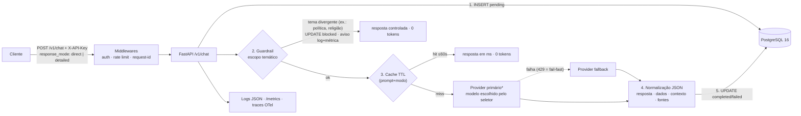
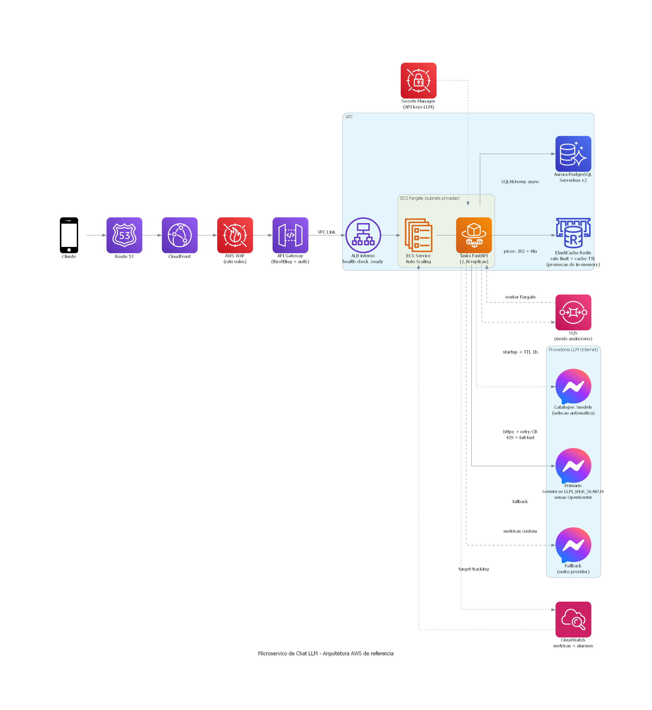

# demo-ms-llm — micro-serviço de chat com LLM, construído por um time de agentes de IA

Micro-serviço que recebe prompts de usuários via `POST /v1/chat`, invoca um LLM
em tempo real (**OpenRouter** e **Gemini**, free tier, com fallback automático,
retry seletivo e circuit breaker por provider) e **persiste prompt e resposta em
PostgreSQL** para análises futuras — o prompt é gravado com `status=pending`
*antes* da chamada ao LLM, então nunca se perde. Por cima disso há uma camada de
inteligência: seleção automática e contínua do melhor modelo por custo/capacidade
(com auto-cura), dois modos de resposta (`direct`/`detailed`), busca web opcional
para dados do dia, saída estruturada normalizada (pronta para virar tabela) e
cache de respostas com TTL. Tudo seguro (auth por API key, rate limit, validação
rigorosa, **guardrail de escopo temático em duas camadas** — temas sensíveis
como política e religião são bloqueados antes do LLM, e qualquer outro tema
fora do escopo econômico-financeiro, como previsão do tempo, é recusado pela
camada semântica; tudo com tentativa auditável e aviso em log/métrica),
observável (logs estruturados, métricas Prometheus, tracing OTel)
e empacotado em Docker.

---

## Como este projeto foi construído: um time de agentes de IA

Este repositório não foi escrito "na mão": ele é o resultado de **12 agentes de
IA especializados trabalhando como um time de engenharia**, com papéis, fases,
paralelismo e revisão cruzada — e todo o processo ficou registrado no próprio
repositório, auditável commit a commit.

### A concepção

Tudo começou com [`AGENT_PROMPTS.md`](AGENT_PROMPTS.md): a especificação de 12
agentes, cada um dono de uma fatia do problema — scaffold da API, persistência,
integração LLM, segurança, observabilidade, qualidade/CI, packaging/docs, e os
quatro agentes de arquitetura da Parte 2 (escalonamento, observabilidade na
nuvem, banco de dados, resiliência), fechando com um revisor final.

### A arquitetura de cérebro e autonomia

Cada agente é uma unidade autocontida em `agents/<id>/`:

- **`agent.yml`** — contrato declarativo: capacidades (`capabilities`),
  ferramentas permitidas (`tools.allow`), nível de autonomia, fase de execução,
  dependências e orçamento (`max_steps`, `token_budget`);
- **`system.md`** — o prompt de sistema com a missão e os critérios de aceite;
- **`shared/context/base_context.md`** — o contexto comum (stack, decisões,
  estrutura de pastas) que todos os agentes recebem, garantindo consistência;
- **`teams/*.yml`** — a orquestração: quais agentes rodam em cada fase, quem
  roda em paralelo e qual gate libera a fase seguinte;
- **`shared/memory/fase*_board.md`** — os **quadros de missão**: cada fase tem
  um board onde os agentes registram entregas, pareceres, correções e vereditos,
  rodada a rodada.

### Como trabalharam na prática

- **Builders + validadores com validação cruzada**: em cada fase, os agentes
  construtores entregavam e outros agentes (de outra especialidade) validavam o
  trabalho — segurança revisando observabilidade, observabilidade revisando
  segurança, qualidade revisando todos.
- **Loops de correção (rodadas)**: um parecer com item bloqueante devolvia o
  trabalho ao builder; a fase só fechava com **aprovação unânime** e a suíte de
  testes verde.
- **Revisão em anel na arquitetura**: na Parte 2, os quatro agentes de
  arquitetura revisaram os documentos uns dos outros em anel, e depois
  re-revisaram tudo contra o código final
  ([`shared/memory/revisao_parte2_board.md`](shared/memory/revisao_parte2_board.md)).
- **Auto-aplicação de higiene**: o agente de qualidade não só apontava — quando
  o achado era de higiene (formatação, config de lint), ele mesmo aplicava a
  correção e registrava a decisão no board.

### Vantagens observadas na prática (exemplos reais dos boards)

| O que aconteceu | Onde está registrado |
|---|---|
| **A revisão cruzada de segurança pegou explosão de cardinalidade de métricas antes de virar bug**: 404/401 pré-roteamento criavam uma série de métrica por path arbitrário no `/metrics` público. O item bloqueou a fase; a correção (label fixo `unmatched`) veio com teste de regressão na rodada seguinte | [`shared/memory/fase3_board.md`](shared/memory/fase3_board.md) |
| **Validadores re-executaram o README literalmente e acharam erros reais**: o agente de qualidade seguiu o passo a passo "sem Docker" comando a comando e corrigiu inconsistências (Locust→k6, nome do serviço do compose, envs faltando no `.env.example`) | [`shared/memory/fase6_board.md`](shared/memory/fase6_board.md) |
| **Bugs de produção viraram testes de regressão no mesmo ciclo**: durante a validação com keys reais, o seletor escolheu um modelo de imagem para texto (400), modelos reasoning devolveram `content: null` (500) e a truncagem por teto vazou raciocínio como resposta — cada um foi corrigido com teste de regressão na mesma rodada | [`docs/RELATORIO_RESULTADOS.md`](docs/RELATORIO_RESULTADOS.md) |
| **Rastreabilidade total**: cada decisão (até um `ignore = ["B008"]` no lint) tem autor, rodada e justificativa nos boards — dá para reconstruir o porquê de cada linha | `shared/memory/fase1..6_board.md` e `fase7_relatorio_final.md` |

O resultado medido: 114 testes, cobertura ≥95%, lint/tipos/segurança limpos, e
um caminho comum de ~8s para dado real do dia (0,07 ms em cache hit) — detalhes
em [`docs/RELATORIO_RESULTADOS.md`](docs/RELATORIO_RESULTADOS.md).

---

## Arquitetura da solução

O caminho de um request, peça por peça:



1. **Middlewares** — antes de qualquer lógica, o request passa por autenticação
   (`X-API-Key` comparada contra hash SHA-256), rate limit por key+IP e recebe um
   `request_id` que correlaciona logs, resposta e erros.
2. **INSERT pending** — o prompt é persistido *antes* da chamada ao LLM. Se tudo
   der errado depois, o dado para análise já está salvo.
3. **Guardrail de escopo temático (duas camadas)** — o escopo do serviço é
   positivo e configurável (`GUARDRAIL_SCOPE`; default: indicadores
   econômico-financeiros). Camada 1: temas sensíveis conhecidos (política e
   religião por padrão) são bloqueados por pré-filtro **antes** do cache e do
   LLM (0 tokens); expressões do domínio econômico ("política monetária") são
   exceções. Camada 2: o system prompt declara o escopo e o modelo sinaliza
   qualquer outro tema divergente (previsão do tempo, esportes...) com a
   sentinela `FORA_DO_ESCOPO`, convertida no mesmo bloqueio. Nas duas: resposta
   controlada (`status=blocked`), tentativa auditável no histórico e aviso
   (WARNING no log + métrica `guardrail_blocked_total{category}`).
4. **Cache TTL** — prompts idênticos (mesmo modo) em até 60s respondem em
   milissegundos com 0 tokens gastos. TTL = idade máxima aceitável do dado.
5. **Cadeia de providers** — o primário é condicional: com busca web ligada, o
   Gemini assume (grounding nativo em 1 chamada); sem busca, OpenRouter com o
   menor modelo free elegível. 429 no primário vai direto ao fallback
   (fail-fast, sem retry inútil); erros transitórios ganham retry com backoff +
   jitter; um circuit breaker por provider evita martelar quem está caindo.
6. **Normalização** — a resposta do LLM é normalizada em um JSON estruturado
   (`resposta`/`dados`/`contexto`/`fontes`) para consumo downstream sem parsing
   frágil.
7. **Persistência final** — o registro `pending` vira `completed` (ou `failed`,
   com o prompt preservado) e a resposta volta ao cliente com `provider`,
   `usage` e `latency_ms`.

**Parte 2 (produção na AWS)**: o desenho completo está em
[docs/architecture.md](docs/architecture.md) — escalonamento 10→100 rps,
observabilidade com SLOs, comparação de bancos e resiliência em 9 degraus.
Destaque para [**docs/architecture/DECISOES_AWS.md**](docs/architecture/DECISOES_AWS.md):
cada escolha de arquitetura vem com **as alternativas viáveis rejeitadas e o
porquê** (Lambda/EKS vs Fargate, ALB puro vs API Gateway, DynamoDB vs Aurora,
Datadog vs stack nativa, multi-region...).



---

## Modos de resposta e escolha automática de modelo

Duas decisões distintas, com donos distintos:

- **O modo de resposta é escolha do usuário final.** Por padrão a resposta é
  **direta e objetiva** (`response_mode: "direct"` — modelo otimizado para
  custo, teto menor de tokens). Quando a necessidade pede contexto e
  profundidade, o consumidor envia `"response_mode": "detailed"` e o serviço
  libera um teto maior e o modelo mais capaz. Quem conhece a necessidade (e paga
  o custo) decide a profundidade.
- **A escolha do MODELO é automatizada** pela melhor relação
  performance × qualidade × custo: o serviço consulta os **catálogos reais** de
  cada provider, prefere **free tier primeiro**, seleciona o menor modelo
  elegível para `direct` e o mais capaz do tier free para `detailed`, **revisa a
  escolha continuamente** (TTL de 1h, configurável) e pratica **auto-cura por
  denylist** — um modelo que devolve erro permanente (400, `content: null`) é
  banido e a seleção refeita na hora, sem intervenção humana. Com busca web
  ligada, o primário vira o **Gemini**, porque o grounding `google_search`
  nativo resolve busca + síntese em **1 chamada** (mais rápido e mais barato que
  plugin de busca + reasoning no OpenRouter — queda medida de 45–84s para ~8s).

A decisão fica visível no log estruturado e no gauge `llm_selected_model` em
`/metrics`. Overrides manuais (`*_MODEL_DIRECT`) e o modelo enviado pelo cliente
(sob allowlist) continuam vencendo, se você quiser controle.

---

## Fonte dos dados de câmbio: PTAX

Para perguntas como "como está a cotação do dólar hoje?", o serviço orienta a
busca web à **PTAX do Banco Central** — uma decisão deliberada, não um default:

- **Metodologia pública e auditável**: a PTAX é calculada pelo Banco Central com
  metodologia publicada; qualquer número pode ser conferido na fonte.
- **Número único e canônico**: portais de notícias e casas de câmbio divergem
  entre si (spread, horário de captura); a PTAX é *o* número de referência.
- **Verificável anos depois**: as respostas são persistidas para analytics — um
  valor PTAX gravado hoje continua verificável contra a série oficial no futuro,
  o que não vale para o "dólar agora" de um portal.
- **Respaldo institucional**: a PTAX liquida contratos financeiros; é o número
  que instituições efetivamente usam.
- **Segurança**: fixar uma fonte oficial de domínio conhecido reduz a superfície
  de envenenamento de resposta via busca web (um site malicioso bem ranqueado
  não vira "a cotação do dia").
- **Parciais intradiárias**: durante o pregão, os boletins parciais da PTAX são
  usados como **o dado oficial mais recente do dia** — a resposta informa que se
  trata de parcial, com horário de referência.
- Fontes de mercado (portais, casas de câmbio) entram **apenas como complemento
  rotulado** em `structured.fontes`, nunca como o valor principal.

---

## O que adicionamos ao payload e por quê

O enunciado permitia alterar os payloads (ponto 4). Cada acréscimo tem um
propósito:

**Entrada** (`POST /v1/chat`):

| Campo | Por quê |
|---|---|
| `response_mode` (`direct`/`detailed`) | O consumidor controla profundidade **e custo** por request |
| `metadata` (objeto livre) | Enriquecimento para analytics futuros (canal, sessão, contexto do cliente) |
| `model` (opcional, sob **allowlist**) | Flexibilidade sem abrir a porta: só modelos aprovados passam (segurança + controle de custo) |

**Saída**:

| Campo | Por quê |
|---|---|
| `structured` (`resposta`/`dados`/`contexto`/`fontes`/`normalizada`) | Normalização downstream sem parsing frágil — `dados` vira tabela direto |
| `status` + `provider` | Transparência do fallback: dá para ver quem respondeu e se a cadeia degradou |
| `usage` (tokens) | Custo observável por request |
| `latency_ms` | Performance observável por request |
| `request_id` (nos erros) | Troubleshooting: o cliente reporta o id e o log conta a história completa |

---

## Playbook: rodando e demonstrando

Roteiro direto, destilado de todas as iterações de validação real. Versão
completa com evidências e capturas: [docs/PLAYBOOK_DEMONSTRACAO.md](docs/PLAYBOOK_DEMONSTRACAO.md).

### As 3 credenciais (a maior fonte de confusão — leia antes de tudo)

| Credencial | O que é | Onde obter | Onde vai |
|---|---|---|---|
| `OPENROUTER_API_KEY` | Key do provider de LLM | <https://openrouter.ai/settings/keys> → *Create Key* (`sk-or-v1-...`) | **Só no `.env`** |
| `GEMINI_API_KEY` | Key do provider de fallback/grounding | <https://aistudio.google.com/apikey> → *Create API key* (`AIza...`) | **Só no `.env`** |
| **API key do serviço** | Senha que **você inventa** para os clientes da SUA API | Você cria (ex.: `demo-2026`) | O **hash SHA-256** vai no `.env` (`API_KEY_HASH`); a **senha em texto** vai no header `X-API-Key` de cada request |

**Nunca use a key de um provider como `X-API-Key`** — são credenciais de
sistemas diferentes. Gerando o hash da sua senha:

```bash
python -c "import hashlib;print(hashlib.sha256('demo-2026'.encode()).hexdigest())"
```

Em `APP_ENV=dev`, `API_KEY_HASH` vazio desabilita a auth (útil para
experimentar); fora de dev o hash é obrigatório.

### Armadilhas reais que encontramos

- **Mudou o `.env`? Recrie o container**: `docker compose up -d --build` — um
  simples restart pode não repassar as envs novas.
- **PowerShell 5.1 e acentos**: resolvido no serviço — clientes que enviam o
  body em cp1252/latin-1 (`Invoke-RestMethod` do PS 5.1, curl em terminal
  não-UTF-8) funcionam normalmente; o corpo é detectado e re-encodado para
  UTF-8 na borda (`app/core/encoding.py`), então acentos chegam íntegros ao
  guardrail e ao LLM (antes, viravam um 400 genérico).
- **O modelo do Gemini precisa existir no catálogo da SUA key**: confira com
  `GET https://generativelanguage.googleapis.com/v1beta/models` (header
  `x-goog-api-key`) e ajuste `GEMINI_MODEL=` se necessário — com
  `LLM_AUTO_MODEL=true` (padrão) o seletor cuida disso sozinho.

### A demonstração (5 minutos)

```powershell
# 0. Configurar e subir tudo (Postgres + API + migrations)
copy .env.example .env    # edite com as 3 credenciais acima
docker compose up -d --build

# 1. Request direct (padrão) — com LLM_WEB_SEARCH=true, dado real do dia com fonte
Invoke-RestMethod http://localhost:8000/v1/chat -Method Post -ContentType "application/json" `
  -Headers @{"X-API-Key"="demo-2026"} `
  -Body '{"user_id":"demo","prompt":"Como esta a cotacao do dolar hoje?"}'

# 2. Mesmo prompt em modo detailed (modelo mais capaz, teto maior)
#    ... -Body '{"user_id":"demo","prompt":"...","response_mode":"detailed"}'

# 3. Repita o passo 1 em ate 60s -> cache hit: latency_ms ~0,1 e usage com 0 tokens

# 4. Seguranca ao vivo: sem o header X-API-Key -> 401 com envelope e request_id
Invoke-RestMethod http://localhost:8000/v1/chat -Method Post -ContentType "application/json" `
  -Body '{"user_id":"demo","prompt":"oi"}'

# 5. Persistencia: todo request (incluindo cache hit e falhas) esta no banco
Invoke-RestMethod http://localhost:8000/v1/conversations/demo -Headers @{"X-API-Key"="demo-2026"}

# 6. Observabilidade: as decisoes automaticas sao auditaveis
curl.exe -s http://localhost:8000/metrics | findstr "llm_selected_model llm_cache_hits llm_fallback"
docker compose logs app --tail 20   # logs JSON com request_id, selecao de modelo, retries
```

O que observar em cada resposta: `provider` (fallback visível), `model`
(escolhido pelo seletor), `structured.dados` (linhas indicador/valor/fonte
prontas para tabela), `usage` e `latency_ms`. Se ambos os providers caírem, a
resposta é `503` honesta e o prompt fica salvo com `status=failed`.

Sem keys configuradas (valores `changeme` do `.env.example`) o serviço sobe com
um **cliente echo offline** — perfeito para testar o fluxo completo sem provider.

---

## Rodando sem Docker

```bash
python -m venv .venv
# Linux/macOS:  source .venv/bin/activate   |  Windows: .venv\Scripts\Activate.ps1
pip install -r requirements.txt -r requirements-dev.txt
```

Com PostgreSQL local: `alembic upgrade head && uvicorn app.main:app --port 8000`.
Sem banco nenhum (repositório em memória):

```bash
# Linux/macOS
REPOSITORY_BACKEND=memory uvicorn app.main:app --port 8000
# Windows (PowerShell)
$env:REPOSITORY_BACKEND = "memory"; uvicorn app.main:app --port 8000
```

Stack de observabilidade opcional (Prometheus, Grafana, Jaeger):
`docker compose --profile observability up -d --build`.

## Testes, lint e Makefile

```bash
make install     # deps de runtime + dev
make test        # pytest (114 testes, sem rede)
make cov         # cobertura (~95%, gate 80%)
make lint        # ruff check + ruff format --check
make typecheck   # mypy app
make security    # bandit + pip-audit
make run         # uvicorn --reload
make up / down   # docker compose
```

No Windows sem `make`, rode o equivalente direto: `python -m pytest -q`,
`python -m ruff check app tests`, `python -m mypy app`. Teste de carga (k6) em
`tests/load/`. CI roda lint/typecheck/security/test em todo push/PR.

## Estrutura de pastas

```
app/
  api/            # rotas: v1/chat.py, health.py, deps.py
  core/           # config, auth, rate limit, logging, métricas, tracing, middlewares
  services/       # llm.py, providers.py, model_selector.py, cache.py, resilience.py
  repositories/   # protocolo + in-memory, postgres.py, database.py
  models/         # SQLAlchemy
  schemas/        # Pydantic (validação estrita, extra=forbid)
migrations/       # Alembic
tests/            # unit + contrato + segurança + observabilidade; tests/load (k6)
docs/             # security.md, observability.md, architecture/ (Parte 2), playbook
observability/    # provisioning Prometheus/Grafana do perfil do compose
agents/ teams/ shared/  # o time de agentes de IA que construiu o projeto (documentação do processo; não usado em runtime)
```

## Segurança, resiliência e observabilidade

- **Segurança** ([docs/security.md](docs/security.md)) — auth por `X-API-Key`
  vs hash SHA-256, rate limit por key+IP, limite de body (413), allowlist de
  modelos, guardrail de escopo temático em duas camadas (temas sensíveis
  bloqueados antes do LLM + escopo positivo semântico via sentinela, com
  auditoria e aviso), CORS fechado, headers de segurança, validação estrita,
  imagem Docker non-root.
- **Resiliência** ([docs/architecture/04](docs/architecture/04_resiliencia.md)) —
  prompt persistido antes do LLM; timeouts explícitos; retry seletivo com
  backoff + jitter; fail-fast em 429; circuit breaker por provider; fallback;
  auto-cura por denylist; `503` honesto com o prompt já guardado.
- **Observabilidade** ([docs/observability.md](docs/observability.md)) — logs
  JSON correlacionados por request-id, métricas Prometheus em `/metrics`,
  tracing OpenTelemetry opcional, dashboards Grafana provisionados.

## Governança do repositório

A branch `main` é **protegida**: toda mudança entra por **Pull Request com
aprovação do mantenedor** — nenhum push direto. O histórico de PRs complementa
os boards de `shared/memory/` como trilha de auditoria do que mudou e por quê.

## Licença e autor

MIT ([LICENSE](LICENSE)) — Felipe F. Barral.
