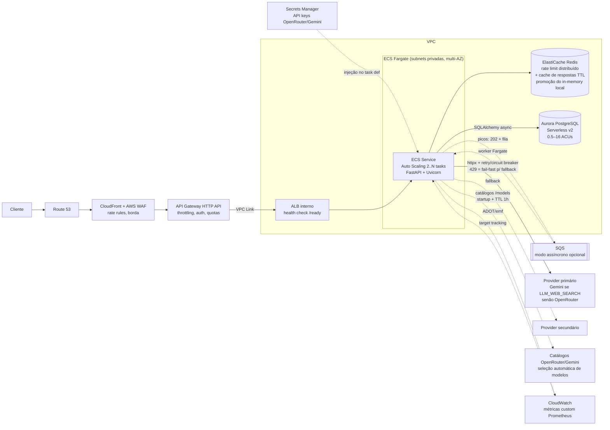

# 1. Arquitetura cloud native na AWS e escalonamento

> Seção 1 de [docs/architecture.md](../architecture.md). Descreve como o micro-serviço
> deste repositório (FastAPI + PostgreSQL + providers LLM com fallback) seria implantado
> na AWS e como ele absorve oscilações de carga.

## 1.1 O que estamos implantando (âncora no código real)

A arquitetura abaixo não é genérica: ela é o deploy do serviço que existe neste repo.
Os pontos do código que influenciam decisões de nuvem são:

| Característica do código | Consequência arquitetural |
|---|---|
| FastAPI/Uvicorn stateless, container único (`Dockerfile` multi-stage) | Candidato ideal a ECS Fargate com N réplicas atrás de um balanceador |
| PostgreSQL 16 + SQLAlchemy 2.0 async + Alembic (`app/repositories`, `migrations/`) | Aurora PostgreSQL Serverless v2 é drop-in (mesmo wire protocol); migrations rodam como task ECS one-off |
| Retry + circuit breaker + fallback entre providers (`app/services/resilience.py`, `app/services/providers.py`); **429 não é retentado** — fail-fast direto para o próximo provider; a **ordem da cadeia muda por configuração** (`LLM_WEB_SEARCH=true` → Gemini primário com grounding nativo, OpenRouter fallback) | A resiliência a falha de provedor LLM já está na aplicação; a nuvem cuida de resiliência de infra (multi-AZ, auto scaling). O fail-fast em 429 encurta o pior caso do budget síncrono (sem backoff de ~8s antes do fallback) |
| Rate limit **in-memory** (`app/core/ratelimit.py`) **e cache de respostas TTL in-memory** (`app/services/cache.py`, chave = hash(modo+model+prompt), `LLM_CACHE_TTL_SECONDS` default 60s), ambos documentados como single-réplica | Ao escalar horizontalmente, limite e cache viram "por task" (limite efetivo N×, hit rate diluído); a evolução é **promover ambos** ao ElastiCache (Redis) como store compartilhado — mesma chave, mesmo TTL — ver 1.2 |
| Seleção automática de modelos (`app/services/model_selector.py`) consulta os **catálogos externos** dos providers (OpenRouter/Gemini `GET /models`) no startup e por TTL (`LLM_MODEL_REFRESH_SECONDS`, default 1h) | Egress adicional via NAT Gateway (marginal: ~1 chamada/h/task); falha de catálogo não derruba request (mantém última seleção ou default do env) — nenhuma dependência nova de disponibilidade |
| Métricas Prometheus (`app/core/metrics.py`) e OTel opt-in (`app/core/tracing.py`) | Métricas viram métricas custom no CloudWatch (via ADOT sidecar/coletor) e alimentam o auto scaling — ver 1.3 |
| Healthchecks reais `/health` e `/ready` (`app/api/health.py`) | Usados diretamente como health check do target group/ECS, evitando enviar tráfego a task sem DB |
| Segredos 100% via env vars (`pydantic-settings`, `app/core/config.py`) | Injeção nativa via Secrets Manager → definição de task ECS, sem mudança de código |

## 1.2 Arquitetura de referência

PNG gerado como código em [`docs/diagrams/aws_architecture.py`](../diagrams/aws_architecture.py)
(lib `diagrams`/mingrammer + Graphviz):

Para regenerar: `pip install diagrams`, instalar Graphviz (`winget install Graphviz.Graphviz`
ou `apt install graphviz`) e rodar `python docs/diagrams/aws_architecture.py`.

### Papel de cada componente (validação da proposta)

- **Route 53** — DNS com health check de failover; barato e trivial. Mantido.
- **CloudFront + WAF** — a API é dinâmica (pouco cacheável), mas o CloudFront agrega
  TLS na borda, absorção de picos de conexão e é o ponto de anexo do WAF. As *rate-based
  rules* do WAF cortam abuso grosseiro (ex.: >2000 req/5min por IP) **antes** de custar
  computação. Mantido, com ressalva: se custo for crítico no MVP, WAF direto no API
  Gateway sem CloudFront é aceitável.
- **API Gateway (HTTP API) em vez de ALB** — escolhido porque o requisito pede
  amortecimento de picos: o API Gateway dá throttling por rota/por chave, quotas, e
  auth (a API já usa API key via `app/core/auth.py`; usage plans casam bem). ALB seria
  mais barato em volume alto e sustentado, mas não faz throttling — a proteção teria
  que viver toda na aplicação. Para carga oscilante, o API Gateway vence.
  **Elo API GW → ECS**: o HTTP API não fala com tasks em subnet privada diretamente —
  a integração é via **VPC Link para um ALB interno**, que faz o health check `/ready`
  (`app/api/health.py`) por target group e distribui entre as tasks — é o mesmo
  mecanismo de retirada de instâncias não saudáveis assumido pela seção 4
  (resiliência). Esse ALB interno não substitui o API Gateway, que continua sendo
  a borda pública com throttling.
  **Trade-off do timeout de 29s (importante)**: o teto de integração do API Gateway é
  29s, e o **default atual do serviço já o excede** — `llm_timeout_seconds = 30.0`
  (`app/core/config.py`). Pior: o orçamento síncrono acumulado não é um único
  timeout; com `llm_max_retries = 2` (retries com backoff exponencial + jitter em
  `resilience.py`) e ainda o fallback para o segundo provider, o pior caso teórico
  passa de 90s. Duas evoluções da Parte 1 já ajudam esse budget: **429 não é
  retentado** (fail-fast para o fallback, sem ~8s de backoff) e o **cache TTL**
  responde prompts repetidos em ms sem tocar o LLM. Ainda assim, em produção
  atrás do API Gateway é obrigatório: (a) reduzir o timeout
  unitário via env (ex.: `LLM_TIMEOUT_SECONDS=10`) e (b) tratar o conjunto
  retries+fallback como um **deadline total por request** de ~25s (margem sobre os
  29s) — hoje isso significa calibrar timeout×retries para caber no budget
  (ex.: 10s × 2 tentativas + 1 fallback curto), e é uma evolução razoável do
  `ResilientLLMClient` aceitar um deadline explícito. Requests que legitimamente
  precisem de mais que isso pertencem ao modo assíncrono via SQS (1.3), que não tem
  esse teto.
- **ECS Fargate** — roda a imagem existente sem gerenciar EC2. Mínimo de 2 tasks em
  AZs distintas. Veredito contra Lambda/EKS em 1.6.
- **Aurora PostgreSQL Serverless v2** — compatível com o PostgreSQL 16 usado; escala
  ACUs em segundos acompanhando a carga de escrita de conversas. RDS Proxy (ou o Data
  API) na frente para multiplexar conexões, já que N tasks async cada uma com pool
  próprio esgotariam conexões rapidamente em pico.
- **Secrets Manager** — guarda `OPENROUTER_API_KEY`, `GEMINI_API_KEY`, DSN do banco e
  as API keys do serviço; injetados como env vars no task definition. Zero mudança de
  código (config já é 100% env). Rotação sem redeploy de imagem.
- **ElastiCache (Redis)** — promoção a store compartilhado de dois componentes que
  **já existem** in-memory na aplicação, ambos com a mesma limitação documentada de
  single-réplica: o rate limit (`app/core/ratelimit.py` conta por processo; com N
  tasks o limite efetivo vira N× o configurado → sliding window compartilhada via
  `INCR`+TTL) e o **cache de respostas TTL** (`app/services/cache.py`: chave =
  hash(modo+model+prompt), `LLM_CACHE_TTL_SECONDS` default 60s; por task o hit rate
  se dilui em 1/N — no Redis a mesma chave e o mesmo TTL valem para o cluster
  inteiro, e um hit em qualquer task poupa tokens e ~8–15s de LLM). A migração é
  troca de store, não de desenho: chaves, TTLs e semântica já estão definidos no
  código. É evolução, não pré-requisito: o serviço funciona sem ele.
- **SQS** — válvula de escape para picos extremos (1.3). Opcional no caminho feliz.
- **Egress para catálogos de modelos** — a seleção automática
  (`app/services/model_selector.py`) consulta `GET /models` dos providers no startup
  e a cada `LLM_MODEL_REFRESH_SECONDS` (1h). Nas subnets privadas isso sai pelo mesmo
  NAT Gateway das chamadas de inferência — volume desprezível (~1 req/h/task), mas
  vale registrar: (a) o startup de task nova faz essa chamada antes do primeiro
  request (best-effort, não bloqueia o `/ready`); (b) falha de catálogo nunca derruba
  request — mantém a última seleção boa ou cai no default do env, então o catálogo
  **não** entra na análise de disponibilidade como dependência dura.

## 1.3 Escalonamento para oscilação de carga

### Camada de aplicação — ECS Service Auto Scaling

Target tracking com **três** métricas (vale a que exigir mais capacidade):

| Métrica | Alvo | Origem |
|---|---|---|
| `ECSServiceAverageCPUUtilization` | 60% | nativa |
| `ECSServiceAverageMemoryUtilization` | 70% | nativa |
| **Custom: requests em voo por task** | ~20 req/task | ver derivação abaixo; publicada no **CloudWatch** via ADOT |

Sobre a métrica custom — sendo preciso com o que existe hoje: `app/core/metrics.py`
**não** exporta um gauge de requests em voo. Ela é obtida de duas formas:

- **Curto prazo (sem mudança de código)**: derivada das métricas reais pela lei de
  Little — concorrência ≈ `rate(http_requests_total[1m]) ×` duração média, com a
  duração vinda do histogram `http_request_duration_seconds`
  (`sum(rate(..._sum[1m])) / sum(rate(..._count[1m]))`). O coletor ADOT calcula/agrega
  e publica no CloudWatch.
- **Evolução recomendada**: criar o gauge `http_requests_in_progress` no middleware
  (incremento/decremento por request) — mais direto e sem atraso da janela de rate.

Pipeline alinhado com a seção 2 (observabilidade): o ADOT tem **destino duplo** —
`remote_write` para AMP (dashboards/alertas Grafana) **e** exporter EMF/CloudWatch
**apenas** para a(s) métrica(s) de scaling, porque o ECS Service Auto Scaling
(Application Auto Scaling) só consome métricas do CloudWatch. Restringir o que vai
para EMF mantém custo e cardinalidade controlados.

A métrica custom é a mais importante: o serviço é **I/O-bound** (a maior parte do tempo
de request é esperar o LLM), então CPU fica baixa mesmo com o serviço saturado de
requisições concorrentes. Escalar só por CPU deixaria o serviço afogar sem reagir.

Assimetria deliberada (scale-out agressivo, scale-in conservador):

- **Scale-out**: cooldown 60s, pode dobrar a capacidade num passo (step scaling
  complementar para saltos: +50% se a métrica passar 2× o alvo).
- **Scale-in**: cooldown 300–600s, remove no máximo 1–2 tasks por passo. Evita
  *flapping* quando a carga oscila e protege contra o custo de cold start de novas
  tasks Fargate (~40–60s entre provisionar e passar no `/ready`).
- Piso 2 tasks (HA multi-AZ), teto dimensionado pelo orçamento (ex.: 30–40, coerente
  com o cenário 10× de 1.3).

### Camada de dados — Aurora Serverless v2

- ACUs mín. 0.5, máx. 16 (ajustável); escala em segundos, sem janela de indisponibilidade.
- O workload de banco é leve por request (1 INSERT por conversa + leituras eventuais),
  então o banco escala bem menos que a aplicação — as ACUs acompanham suavemente.
- RDS Proxy absorve a tempestade de conexões quando o ECS multiplica tasks.
- Réplica de leitura (também Serverless v2) só quando surgirem as "análises futuras"
  do requisito de persistência, para isolar workload analítico do transacional.

### Borda — amortecedor de picos

- **API Gateway**: throttle por estágio (ex.: 500 rps burst 1000) e por usage plan/API
  key (ex.: 50 rps por cliente). Excesso recebe `429` na borda — o mesmo contrato que a
  aplicação já devolve no rate limit dela — sem consumir Fargate.
- **WAF rate rules**: bloqueio por IP para abuso volumétrico, e regras gerenciadas
  (SQLi/XSS) como defesa em profundidade além da sanitização da aplicação.
- Defesa em camadas: WAF (abuso bruto) → API Gateway (justiça por cliente) →
  rate limit da aplicação via Redis (regra fina de negócio).

### Picos extremos — SQS como válvula de escape

Quando nem o auto scaling acompanha (ou quando o provedor LLM vira o gargalo — os free
tiers têm rate limits próprios, que o circuit breaker de `resilience.py` já detecta):

1. `POST /v1/chat` passa a responder `202 Accepted` + `id`, enfileirando em SQS.
2. Workers (o mesmo container em modo consumidor, serviço ECS separado escalado por
   `ApproximateNumberOfMessagesVisible`) processam no ritmo que os provedores aguentam
   e persistem no banco.
3. Cliente recupera via `GET /v1/chat/{id}` (polling) ou webhook.

Trade-offs, para deixar honesto:

- **Contra**: quebra o contrato síncrono atual (cliente precisa suportar 202+polling);
  mais partes móveis (fila, DLQ, worker); latência percebida maior no caso comum.
- **A favor**: nenhum request é perdido em pico; o backpressure fica explícito e
  mensurável (profundidade da fila); protege os rate limits dos free tiers, que são o
  recurso mais escasso do sistema.
- **Recomendação**: modo híbrido — síncrono por padrão; comutar para 202+fila via flag
  quando profundidade de fila/latência p99/estado do circuit breaker cruzarem limiar.

### Cenário numérico: base 10 rps → pico 100 rps (10×)

Premissas (calibradas com as medições reais da seção 5.4): latência média por request
dominada pelo LLM ≈ 5–7s sem busca web e ~8–15s com grounding — adotamos **~6s de
média ponderada** considerando mix de modos e uma fração de cache hits (ms) ⇒ ~6
requests em voo por rps; alvo de 20 em voo por task ⇒ 1 task atende ~3 rps
(a espera é I/O async, então subir o alvo por task é ajuste fino, não limite duro).

| Camada | Base (10 rps) | Pico (100 rps) | O que acontece e em quanto tempo |
|---|---|---|---|
| WAF/API GW | ocioso | corta o que exceder throttle (ex.: >150 rps agregado vira 429) | imediato (0s) |
| ECS Fargate | ~4 tasks (~60 em voo; piso 2 + auto scaling estabilizado) | ~25–30 tasks (~600 em voo, menos o que o cache absorver) | alarme dispara em ~1–2min de breach; step scaling dobra por leva; cada leva fica pronta em ~60s; capacidade plena em **~4–6 min** |
| Aurora Sv2 | ~0.5–1 ACU | ~2–4 ACUs (100 inserts/s é leve) | segundos, transparente |
| ElastiCache | contadores de rate limit + cache de respostas | o cache **amortece o próprio pico**: tráfego 10× tende a repetir prompts; cada hit (TTL 60s) responde em ms com 0 tokens, reduzindo os requests em voo que dirigem o auto scaling e poupando o free tier dos LLMs | imediato |
| Provedores LLM | dentro do free tier | **provável gargalo real**: 429 do primário → **fail-fast** (sem retry/backoff) direto para o fallback (`resilience.py`), contando para o circuit breaker; se ambos degradarem, breaker abre e `503` limpo (ou desvio para SQS) | imediato (~8s de backoff eliminados por request vs retry ingênuo) |
| Janela de 3–5 min do scale-out | — | excesso é amortecido pelo burst do API GW + fila de conexões; pior caso, parte dos clientes recebe 429/latência alta — comportamento degradado controlado, não colapso (a experiência do cliente por cenário de falha está consolidada na tabela 4.4 de [04_resiliencia.md](04_resiliencia.md)) | — |

Após o pico: scale-in devagar (cooldown 300–600s, 1–2 tasks por vez) — voltar à base
leva ~15–30 min de propósito, o que custa centavos e evita oscilação.

## 1.4 Custos (qualitativo)

- **O que domina**: Fargate (vCPU-hora × tasks × tempo). Como as requests passam a
  maior parte do tempo esperando o LLM, tasks pequenas (0.25–0.5 vCPU / 1 GB) com alta
  concorrência async por task são o melhor custo-benefício — exatamente o perfil do
  FastAPI async deste repo.
- **Fargate Spot** para a capacidade acima do piso (piso de 2 tasks on-demand para HA;
  o excedente do auto scaling em Spot): até ~70% de desconto, e a interrupção de Spot é
  tolerável porque o serviço é stateless e o deregistration delay drena as conexões.
- **Aurora Serverless v2** cobra por ACU-hora: em carga base fica perto do mínimo
  (0.5 ACU); é o segundo maior custo, mas proporcional ao uso — melhor que RDS
  provisionado para carga oscilante.
- **LLM**: custo financeiro ~zero (free tiers OpenRouter/Gemini), mas paga-se em
  **rate limit** — por isso cache Redis e o modo SQS têm ROI direto.
- **Perto de zero em repouso**: WAF/API GW/SQS cobram por request; CloudFront e
  CloudWatch são marginais neste volume (atenção apenas à cardinalidade de métricas
  custom, cobradas por métrica).

## 1.5 Alternativas consideradas

| Critério | Lambda | **ECS Fargate (escolhido)** | EKS |
|---|---|---|---|
| Ajuste ao código atual | Exige adaptador (Mangum) e repensar pool de conexões/lifespan | Roda o Dockerfile existente sem mudanças | Roda o container, mas exige manifests/Helm |
| Cold start com carga oscilante | Sensível (agravado por chamadas de 2–10s a LLM segurando concorrência: 1 request = 1 execução) | Task nova em ~60s, mas o piso de 2 tasks absorve o comum | Igual ao Fargate + latência do cluster autoscaler |
| Chamadas longas a LLM | Paga-se GB-s pelo tempo **de espera** do LLM — caro para I/O-bound; timeout máx. 15min ok, mas custo escala errado | Uma task async atende dezenas de requests em espera simultaneamente | Idem Fargate |
| Complexidade operacional | Baixa | Baixa/média | **Alta** (upgrades, add-ons, IAM/IRSA) — injustificável para 1 serviço |
| Custo em repouso | Zero (melhor se tráfego ≈ 0) | Piso de 2 tasks pequenas | Custo fixo do control plane (~US$ 73/mês) + nós |

**Veredito**: ECS Fargate. O fator decisivo é o perfil I/O-bound: no modelo async do
FastAPI, uma task barata segura dezenas de chamadas LLM concorrentes; no Lambda cada
request em espera é uma execução cobrada. EKS só se justificaria num ecossistema
multi-serviço com plataforma Kubernetes já existente; Lambda seria plausível apenas
para tráfego quase nulo ou para o worker SQS (evolução possível).

## 1.6 Resumo das decisões

1. API Gateway como borda (throttling nativo = amortecedor de pico), integrado ao ECS
   via VPC Link + ALB interno; teto de 29s aceito **com** deadline total por request
   de ~25s — o default `llm_timeout_seconds=30s` deve ser sobrescrito via env em
   produção, e retries+fallback calibrados para caber no budget (casos longos → SQS).
2. Métrica custom de requests-em-voo por task como driver principal do auto scaling
   (serviço I/O-bound; CPU mente). Hoje derivada de `http_request_duration_seconds`
   via ADOT (lei de Little); evolução: gauge `http_requests_in_progress`. Publicada no
   CloudWatch (EMF) além do AMP — pipeline duplo alinhado com a seção 2.
3. Scale-out agressivo (60s) / scale-in conservador (300–600s) — anti-flapping.
4. Aurora Serverless v2 + RDS Proxy: banco acompanha a app sem esgotar conexões.
5. Redis **promove** os dois stores in-memory já existentes na aplicação — rate limit
   (`app/core/ratelimit.py`) e cache de respostas TTL (`app/services/cache.py`) — a
   distribuídos, com as mesmas chaves e TTLs; troca de store, não de desenho.
6. SQS como modo degradado explícito para picos além do auto scaling — híbrido, atrás
   de flag, com trade-off de contrato documentado.
7. Fargate on-demand no piso + Spot no excedente para custo.
