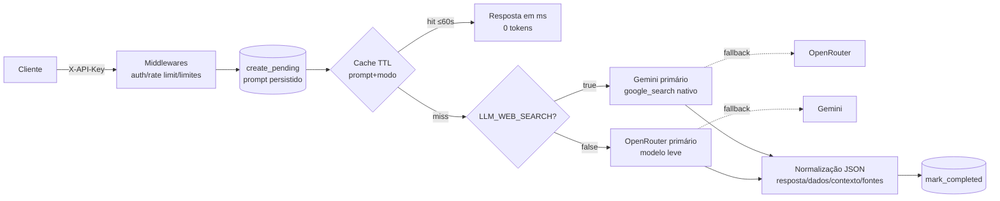

# 5. Evoluções pós-entrega — camada de inteligência de LLM

Esta seção revisa a arquitetura após os ajustes feitos durante a validação em
ambiente real (docker compose + keys reais), mantendo a aderência aos
requisitos do desafio: qualidade, segurança, resiliência, performance e custo.

## 5.1 Fluxo atual de uma requisição

## 5.2 Decisões e por que atendem ao desafio

| Evolução | Decisão | Requisito atendido |
|---|---|---|
| **Seleção automática de modelos** | Catálogos reais consultados com TTL de 1h; direct = menor free elegível, detailed/grounded = mais capaz do tier free; exclui pagos, previews, não-texto e <3B | Performance + custo: ninguém escolhe modelo à mão; free tier sempre que possível |
| **Auto-cura (denylist)** | Modelo que responde erro permanente (400/404, content nulo) sai da seleção e a re-escolha é imediata | Resiliência: o serviço se corrige sem intervenção |
| **Teto adaptativo + memória de truncagem** | Resposta truncada pelo cap (thinking) repete 1x sem teto; o modelo fica marcado e as próximas vão direto sem teto | Performance: elimina chamada desperdiçada por request |
| **429 sem retry (fail fast)** | Rate limit do primário cai imediatamente para o fallback (conta para o breaker) | Performance: ~8s de backoff eliminados por request |
| **Gemini primário com grounding** | `google_search` nativo resolve busca+síntese em 1 chamada (~8–15s/1–2k tokens) vs plugin web + reasoning (30–80s/4k) | Performance + custo no caminho comum |
| **Cache de respostas TTL** | (prompt, modo, model) por 60s; hit = ms e 0 tokens; cada request segue persistido | Performance + custo; regra de frescor explícita (5.3) |
| **`response_mode` direct/detailed** | Direto = 1 frase objetiva; detailed = contexto/fontes; cliente escolhe por request | Utilidade + custo controlado pelo consumidor |
| **Saída estruturada normalizada** | Contrato JSON fixo (`resposta/dados/contexto/fontes`) com parser tolerante e fallback seguro | Qualidade: normalização downstream (tabelas) sem parsing frágil |
| **Honestidade temporal** | Data atual injetada no system prompt; prioriza valor intradiário de hoje; recuo imediato ao fechamento de ontem sem buscas extras; nunca "fechou" com mercado aberto | Qualidade/utilidade do dado |
| **charset=utf-8 explícito** | `UTF8JSONResponse` global | Qualidade: interoperabilidade com clientes legados |

## 5.3 Política de frescor: cache × busca web

Regra única e configurável: **`LLM_CACHE_TTL_SECONDS` é a idade máxima aceitável
de um dado** (default 60s). Dentro da janela, prompts idênticos (texto + modo)
respondem do cache (ms, 0 tokens); fora dela, a busca web roda de novo.
`0` desliga o cache (todo request consulta a web). Para dados pouco voláteis,
aumentar o TTL reduz custo sem perder utilidade. Em produção multi-réplica, o
equivalente é o ElastiCache/Redis da seção 1 (mesma chave, mesmo TTL).

## 5.4 Trade-off de latência assumido (medido em demonstração real)

| Cenário | Latência | Tokens |
|---|---|---|
| Cache hit (janela TTL) | ~0,1 ms | 0 |
| Sem busca web (modelo leve) | ~5–7 s | ~500 |
| Com busca web — Gemini nativo (alvo) | ~8–15 s | ~1–2k |
| Com busca web — pior caso (fallback OpenRouter + reasoning) | 30 s+ | ~3–4k |

Dado real do dia exige busca + síntese: o piso de ~8s é físico no free tier.
O desenho garante que o caminho comum fique no alvo e que repetições custem zero.

## 5.5 Observabilidade das decisões automáticas

Toda decisão da camada de inteligência é auditável: `llm_selected_model`
(modelo escolhido por provider/modo), `llm_cache_hits_total`,
`llm_fallback_total`, `llm_requests_total{outcome}`, `circuit_breaker_state`
e logs estruturados por (re)seleção, denylist e retry sem teto — todos
correlacionados por `request_id`.
